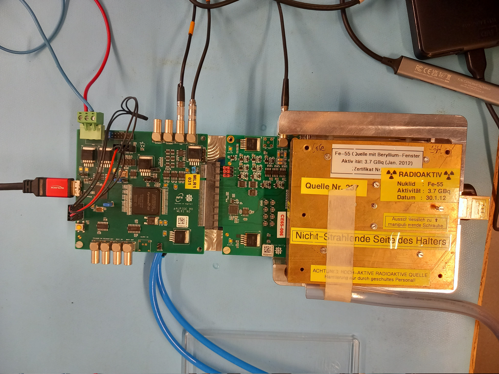

UZH CE65 Documentation

## Table of Contents
- [Lab Measurements](#heading-1)
  - [Hardware Setup](#subheading-2-1)
  - [Data Acquisition](#subheading-2-2)
  - [Analysis](#subheading-2-2)
- [Post-analysis and Fitting Spectra](#heading-2)
- [Testbeam Analysis](#heading-3)

## Lab Measurements
### Hardware Setup

The test setup consists of fundamentally three parts: the FPGA, the proxy board, and the carrier board (which houses the CE65 chip itself), as depicted in Figure INSERT REF. The FPGA board (name this properly...) must be connected via a USB interface to the computer which will act the bus for data transfer. The FPGA board is powered by the large green connector adjacent to the FPGA which is connected to the power supply. The FPGA board also houses the connectors to the SUB and PWELL, which are typically grounded. The HV_RESET connector is situated on the proxy board and provides the bias for the collection node (though only for the AC-coupled submatrix). Finally the carrier board sits beneath the Fe-55 source and should be handled with care. 
A summary of typical parameters for the different connectors is:

 - FPGA power = 5V
 - SUB = PWELL = 0V
 - HV_RESET = 10V 
 
It is important that the polarity of the HV_RESET, SUB, PWELL connections is not reversed (though irrelevant for SUB/PWELL when at 0V). 

When choosing a CE65 chip (V1 or V2) for which data is to be taken it is helpful to follow the following SOP: 

 - If not already done, power off everything which can be done by simply stopping output from the power supply. 
 - Wearing gloves, slightly unscrew the tallest screw (not completely, only until you can slide the metal sheet underneath) on the Fe55 source holder. Slide the separating sheet in and screw in the tall screw until it is secure. The source is now blocked. 
 - Carefully (but sometimes some force is required) slide the source away from the base of the aluminum setup holder. This should expose the carrier board and the CE65 chip. Unscrew the white screws securing the carrier board and store the chip in one of the plastic chip boxes. Always be careful when handling carrier boards, and the wire bonds on the chip are very fragile and any contact is likely to destroy them. After this is done select the chip that is to be tested and plug it into the proxy board, before re-screwing the white plastic screws (do not tighten them much, as they will break).  
 - Slide the source holder back over the setup holder. Remember to unlock the Fe55 source which you can do by again unscrewing the tallest screw on the source holder and sliding the metal sheet out, until the second screw hole can be felt, and screwing the screw back in. Afterwards place the black plastic box over the source, where is should be slightly touching the proxy board and the metal sheet of the source holder. Finally, place the black cloth over the black box such that no light could be reflected into the CE65 chip. 
 - The setup is now ready for data taking, which is described in the next section. 

#### Data Acquisition
